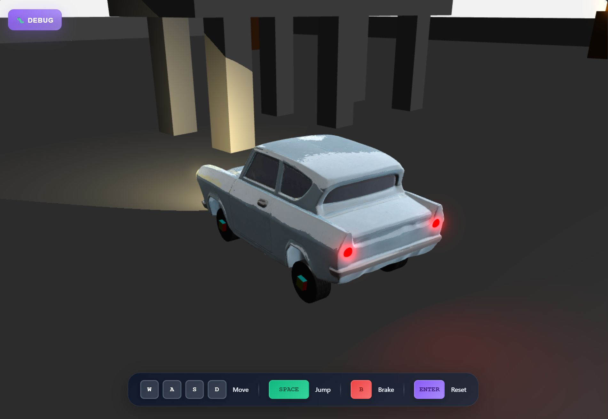
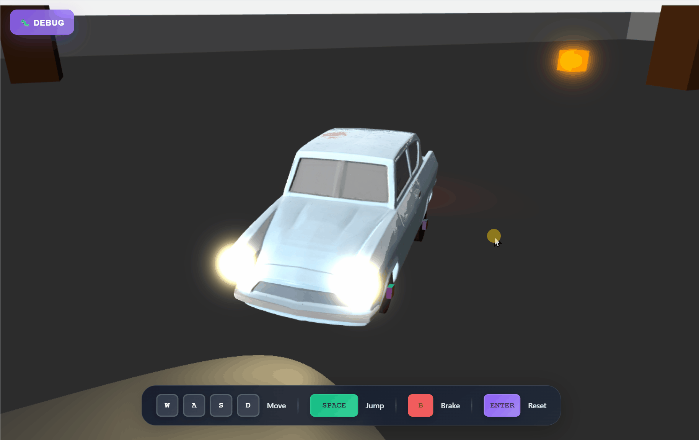

# 🏎️ Babylon.js Car Racing Game

A 3D car racing game built with web technologies (babylon.js), featuring realistic physics, intelligent device detection, custom 3D car models, dynamic lighting, and modular component architecture.

## 🎮 Live Demo

**Play now:** [https://projects.manuelhintermayr.com/babylon-js-car-example](https://projects.manuelhintermayr.com/babylon-js-car-example)



## 🚀 Modern Architecture

This project showcases **advanced game development** using:

### **ES6 Module System**
- **Clean imports/exports** for maintainable code structure
- **Separated concerns** with dedicated modules for each feature
- **Modern JavaScript** with async/await and arrow functions

### **Component-Based Architecture**
- **Vue.js 3** with Composition API for reactive UI
- **Modular components** (`info-panel`, `desktop-controls`, `mobile-controls`)
- **Event-driven communication** between components
- **Props-based data flow** for clean component interaction

### **CSS Organization**
- **Modular stylesheets** for each component and feature
- **Responsive design** with device-specific optimizations
- **Glassmorphism effects** for modern UI aesthetics
- **Cross-platform styling** for desktop and mobile

### **Intelligent Device Detection**
- **CSS media queries** for accurate touch device detection
- **Automatic UI adaptation** based on input capabilities
- **Cross-platform compatibility** (Desktop + Mobile + Tablets)

## 🎮 Advanced Game Features

### 🏁 Core Gameplay
- **Realistic car physics** powered by Havok Physics Engine (based on [Babylon.js Playground demo](https://www.babylonjs-playground.com/#ANV5OM#139))
- **Custom 3D car model** support with GLB/GLTF loading (model created with [ImgTo3D.ai](https://www.imgto3d.ai/), textures with [Meshy.ai](https://www.meshy.ai/))
- **ConvexHull physics** for complex 3D model collision detection
- **Dynamic camera system** with mouse controls and smooth following (based on [Babylon.js mouse control demo](https://playground.babylonjs.com/#FMQX86#1))
- **Jump mechanics** with Space key for aerial stunts
- **Advanced braking system** with B key for precision control
- **Enhanced steering** with optimized responsiveness (4x faster turning)

### 🎯 Game Objectives & Environment
- 🎯 **Knock down boxes** - Hit all 5 orange physics-enabled targets
- 💥 **Navigate obstacles** - Avoid brown collision towers strategically placed around track
- 🌉 **Bridge challenges** - Drive over elevated bridge platforms for bonus points
- 🏎️ **Speed challenges** - Test vehicle performance on varied terrain
- 🎨 **Studio environment** - Race in professional white-walled studio setting

### 💡 Dynamic Lighting System
- **Realistic car lighting** with front headlights and rear taillights
- **Warm white headlights** (#ddc584) with cylindrical lens design
- **Red taillights** with Point Light technology for authentic illumination
- **ESM shadow mapping** for realistic light casting and ground reflections
- **Dark ambient lighting** for dramatic racing atmosphere
- **Dynamic light-surface interaction** with proper material reflections

### 📊 Advanced Telemetry
- **Vehicle telemetry** (speed in km/h, 3D position, rotation)
- **Performance metrics** (total collisions, race time, maximum speed)
- **Physics monitoring** (wheel physics, suspension dynamics)
- **Progress tracking** (knocked boxes counter with physics detection)
- **Interactive debug panels** with F12 toggle and auto-hide on mobile

## 🖥️ Enhanced Cross-Platform Controls

### **Desktop Experience**
- **WASD/Arrow Keys** for movement with real-time visual feedback
- **Space Bar** for jumping mechanics and aerial stunts
- **B Key** for precision braking with force indication
- **Mouse Controls** for 360° camera rotation around vehicle
- **Enter Key** for instant game reset
- **F12/Backtick** for debug panel toggle
- **Key state visualization** with active/inactive indicators

### **Mobile Experience**
- **Virtual joystick** for precise movement control with visual feedback
- **Touch brake button** (🚗) for braking actions
- **Touch jump button** for aerial maneuvers
- **Touch reset button** (🔄) for game restart
- **Responsive touch areas** optimized for finger interaction
- **Auto-hiding desktop controls** on touch devices

### **Intelligent UI Adaptation**
- **Automatic device detection** using CSS media queries
- **Dynamic component visibility** based on input capabilities
- **Optimized layouts** for different screen sizes and orientations
- **Touch-first design** for mobile devices
- **Glassmorphism UI** with modern gaming aesthetics

## 🎬 Gameplay Demo



*Experience realistic car physics and cross-platform controls in action*

## 🏗️ Enhanced Project Structure

```
📦 babylon-js-car-example/
├── 📄 .gitignore             # Git ignore patterns
├── 📄 index.html             # Clean HTML template with module imports
├── 📄 index.js               # 🎯 Application entry point
├── 📄 vue-app.js             # 🎨 Main Vue app with device detection
├── 📄 package.json           # Project dependencies and scripts
├── 📄 LICENSE                # MIT License
├── 📄 README.md              # Project documentation
├── 🖼️ preview.jpg            # Game preview screenshot
├── 🎬 preview.gif            # Gameplay demo animation
│
├── 📁 components/            # 🔧 Modular Vue Components
│   ├── 📄 info-panel.js      # Debug panel with glassmorphism UI
│   ├── 📄 desktop-controls.js # Enhanced keyboard controls with jump/brake
│   └── 📄 mobile-controls.js  # Touch controls with joystick & jump
│
├── 📁 css/                   # 🎨 Modular Stylesheets
│   ├── 📄 main.css           # Core styles, HTML, body, canvas
│   ├── 📄 info-panel.css     # Debug panel glassmorphism styling
│   ├── 📄 mobile-controls.css # Virtual joystick & enhanced touch buttons
│   └── 📄 desktop-controls.css # Key displays with jump/brake indicators
│
└── 📁 game/                  # 🎮 Advanced Game Engine & Assets
    ├── 📄 babylon-game.js    # Complete Babylon.js game with physics & 3D models
    ├── 📁 models/            # 3D Model Assets
    │   └── 📄 car.glb        # Custom 3D car model (GLB format)
    └── 📁 textures/          # Game texture assets
        ├── 📄 tire.png       # Car tire texture
        └── 📄 up.png         # Track/environment textures
```

## 🛠️ Advanced Technology Stack

### **Frontend Architecture**
- **Vue.js 3** - Reactive UI framework with Composition API and ES6 modules
- **Component-Based Design** - Separated concerns with reusable components
- **Event-Driven Architecture** - Clean component communication via Vue events

### **3D Graphics & Advanced Physics**
- **Babylon.js v8.31.0** - Professional 3D rendering engine with WebGL2
- **Havok Physics** - Realistic car dynamics and collision detection
- **ConvexHull Physics** - Complex 3D model collision for custom car shapes
- **GLB/GLTF Model Loading** - Support for custom 3D car models
- **Real-time Rendering** - 60fps smooth gameplay with dynamic lighting

### **Advanced Lighting & Visual Effects**
- **Point Light System** - Realistic car headlights and taillights
- **ESM Shadow Mapping** - Exponential Shadow Maps for soft realistic shadows
- **Dynamic Material Reflections** - Light interaction with car and environment surfaces
- **Atmospheric Lighting** - Reduced ambient lighting for dramatic racing environment

### **Device Detection & Adaptation**
- **CSS Media Queries** - Intelligent touch device detection
- **Responsive Components** - Auto-adapting UI based on input capabilities
- **Cross-Platform Support** - Desktop, mobile, and tablet optimized

### **Styling & Design**
- **Modular CSS** - Component-specific stylesheets for maintainability
- **Glassmorphism Effects** - Modern frosted glass UI aesthetics
- **Studio Environment** - Professional white-walled racing environment
- **Responsive Design** - Optimized layouts for all screen sizes

## 🚀 Getting Started

### **🎮 Try It Now**
**Live Demo:** [https://projects.manuelhintermayr.com/babylon-js-car-example](https://projects.manuelhintermayr.com/babylon-js-car-example)

*No installation required - play directly in your browser!*

### **Prerequisites**
- Modern web browser with ES6 module support
- Local web server (required for ES6 modules)  
- WebGL2 compatible graphics (most modern devices)
- GLB/GLTF support for custom 3D car models

### **Local Development Setup**

1. **Clone the repository**
   ```bash
   git clone https://github.com/manuelhintermayr/babylon-js-car-example.git
   cd babylon-js-car-example
   ```

2. **Start a local server**
   ```bash
   # Using Python
   python -m http.server 8000
   
   # Using Node.js
   npx serve .
   
   # Using PHP
   php -S localhost:8000
   ```

3. **Open in browser**
   ```
   http://localhost:8000
   ```

4. **Optional: Add Custom Car Model**
   - Place your car.glb file in `game/models/`
   - The game will automatically load your custom model
   - Fallback to default box car if model loading fails

### **Development**
The project uses **ES6 modules** which require a web server (not `file://` protocol) for proper functionality.

## 🎮 How to Play

1. **🏁 Start the Game**
   - Open the game in your browser
   - Watch your custom 3D car model load automatically
   - Use `F12` or `` ` `` to open debug panels (optional)

2. **🚗 Master the Controls**
   - **Desktop**: Use WASD keys for movement, Space for jumping, B for braking
   - **Mobile**: Use the virtual joystick with touch jump and brake buttons
   - **Camera**: Use mouse to rotate camera view around your car

3. **🎯 Complete Objectives**
   - Drive around and find the 5 orange boxes scattered across the track
   - Hit them to increase your "Knocked Boxes" counter
   - Avoid brown collision towers to minimize collisions
   - Try jumping over the elevated bridge platform

4. **🏆 Master Advanced Features**
   - Experiment with realistic car physics and aerial jumps
   - Use the dynamic lighting to navigate in low-light conditions
   - Learn to control the vehicle through corners using optimized steering
   - Challenge yourself to knock all boxes with minimal collisions

5. **💡 Experience the Atmosphere**
   - Enjoy realistic headlight and taillight illumination
   - Watch dynamic shadows cast by your car's lights
   - Race in the professional studio environment with white walls

## 🤝 Contributing

1. Fork the repository
2. Create a feature branch (`git checkout -b feature/amazing-feature`)
3. Commit your changes (`git commit -m 'Add amazing feature'`)
4. Push to the branch (`git push origin feature/amazing-feature`)
5. Open a Pull Request

## 📄 License

This project is licensed under the MIT License - see the [LICENSE](LICENSE) file for details.

## 🙏 Acknowledgments

- **Babylon.js Team** - For the incredible 3D engine
- **Vue.js Team** - For the reactive framework
- **Havok Physics** - For realistic physics simulation
- **Modern Web Standards** - For enabling advanced browser capabilities
- **AI Tools** - For 3D model and texture creation:
  - Car 3D model created with [ImgTo3D.ai](https://www.imgto3d.ai/)
  - Car textures created with [Meshy.ai](https://www.meshy.ai/)
- **Babylon.js Community** - For providing excellent demos and examples:
  - Car physics implementation based on [Babylon.js Playground #ANV5OM#139](https://www.babylonjs-playground.com/#ANV5OM#139)
  - Mouse camera controls based on [Babylon.js Playground #FMQX86#1](https://playground.babylonjs.com/#FMQX86#1)

---

*Created with ❤️ and cutting-edge web technologies*